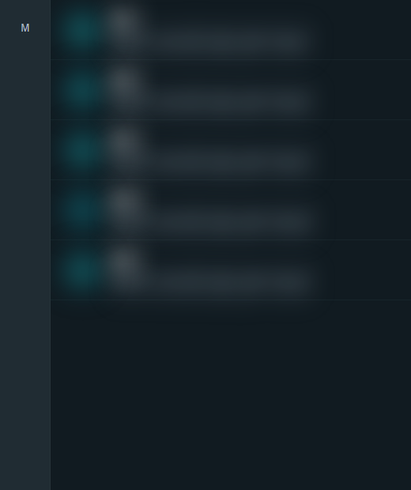

  

  # WAEX Web

  **WhatsApp Web, senin kurallarınla.**

  Yerel gizlilik, seçili sohbet kilidi ve ayrıntılı arayüz kontrolü.

  `v2.1.2` · `Chrome` · `Edge` · `Manifest V3` · `Local-first`

## Öne çıkanlar

- **Görünmez mod:** Okundu, oynatıldı, yazıyor, kayıt ve durum görüntüleme bilgilerini kontrol et.
- **Yerel sohbet kilidi:** Her sohbet tıklamasını içeriği çizmeden önce denetle; kilitliyse geçiş perdesinin arkasında parola iste.
- **WhatsApp içi kontroller:** Sohbet başlığından tek tıkla kilit, panik gizliliği ve Arşivlenenler kontrolü.
- **Arayüz kontrolü:** Sol menü düğmelerini hover alanı ve yerleşim slotuyla birlikte kaldır; kalan ikonları yukarı topla.
- **Panik gizliliği:** Mesaj, isim, profil resmi ve baş harfli avatarları satırlar arasında taşan blur ile gizle.
- **Yerel araçlar:** Anti-revoke, zamanlama, medya indirme ve yerel mesaj düzenleme.

  

  

  

## Gizlilik

WAEX Web hesap, telemetri veya harici sunucu kullanmaz. Ayarlar ve yerel kayıtlar tarayıcıdaki eklenti alanında tutulur. Sohbet kilidi parolası düz metin olarak saklanmaz.

## Durum

WAEX Web şu anda özel dağıtımdadır. Bu depo ürün vitrini ve sürüm duyuruları içindir; kaynak kod burada yayımlanmaz.

---

  Made with ♥ by <strong>Wiojelt</strong>  
  <a href="https://github.com/Wiojelt">GitHub</a> · <a href="https://x.com/Wiojelt">X / Twitter</a>

